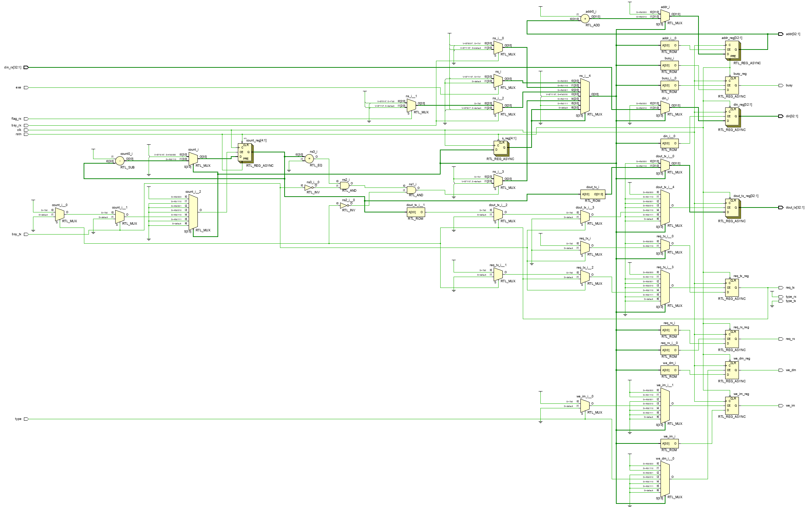
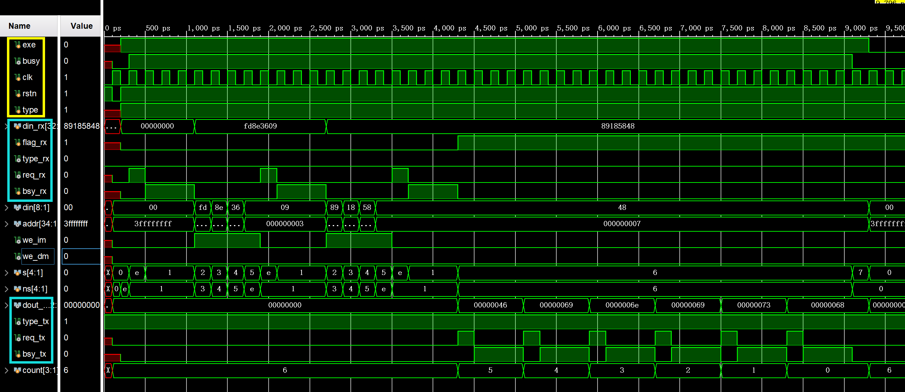

# CPU竞赛Lab2实验报告

### 2023.4.x

> - PB21000069 林润锋
>
> - PB21000144 吕思翰
>
> - PB21000164 来泽远
>
> - PB21000193 徐翊然
>
> - PB21020659 曹宸瑞
>

## 实验目的与内容

- 实现支持串口通信的cpu调试单元，方便后续cpu的调试工作

- 能够支持以下指令

  1. 控制运行方式

     - T：Step, CPU单步运行，运行1个时钟周期即停止


     - B：Breakpoint, 设置/删除/查看断点，最多可有2个断点
    
     - G：Go, CPU连续运行，遇到断点或收到停止命令H则停止
    
     - H：Halt, 停止CPU运行


  2. 查看运行状态

     - P： Datapath, 查看数据通路状态

     - R：Register File, 查看寄存器堆内容

     - D：Data Memory, 查看数据存储器内容


     - I：Instruction Memory, 查看指令存储器内容

  3. 加载存储器

     - LI：Load Instruction, 将程序加载至指令存储器

     - LD：Load Data, 将数据加载至数据存储器

## 逻辑设计

主要利用了函数调用的思想，通过主状态机对各个分状态机进行调用并且转移I/O通讯权实现功能。采用exe-busy的异步通信模式。

（有啥大框架要说的在这写）

### I/O

小RTL截图

定义接口 说明接口类型和作用

若内部分模块的视情况放更小的模块RTL截图

核心代码1

作用xxx

```verilog
assign a=b;
```

核心代码2

作用xxx

```verilog
assign b=a;
```

（代码直接贴）

### 主状态机


### 分状态机：T、B、G、H


### 分状态机：P、R、D、I


### 分状态机：LI、LD

1. 定义接口：

    ```verilog
    module FSMLOAD(
        input clk,rstn,
        input exe,//主状态机输入此信号，代表进入分状态机
        output reg busy,//分状态机输出此信号，代表执行未结束
        input type,//选择LD与LI两种模式，由主状态机确定
        //与输入模块通信
        input [32:1]din_rx,//获取数据
        input flag_rx,//若读取结束，flag_rx为1
        output type_rx,//选取输入模式
        output reg req_rx,//输入请求
        input bsy_rx,//输入模块处理完成
        //与输出模块通信
        output reg [32:1]dout_tx,//待输出数据
        output type_tx,//输出模式
        output reg req_tx,//输出请求
        input bsy_tx,//输出模块处理完成
        //与CPU的IM或DM通信
        output reg [32:1]din,
        output reg [32:1]addr,
        output reg we_dm,
        output reg we_im
    );
    ```

2. RTL分析：



3. 核心代码：

   - 主状态机转换代码：

       ```verilog
       always  @(*) begin
           ns = s;
           case (s)
               ZERO: begin//waiting
                   if(exe) ns = FOURTEEN;
                   else ns=ZERO;
               end
               FOURTEEN:
                   if(bsy_rx) ns = ONE;
                   else ns = FOURTEEN;
               ONE: begin//waiting for scan to complete
                   if(!bsy_rx) if(!flag_rx) ns = TWO; else ns=SIX;
                   else ns = ONE;
               end
               TWO: begin//fetch [32:1]din_rx, send [32:25]din_rx
                   ns = FOURTEEN;
               end
               SIX: begin//no more data,print finish
                   if (!count&!bsy_tx&!req_tx)ns=SEVEN;
                   else ns = SIX;
               end
               SEVEN: begin//set busy  to 0
                   ns = ZERO;
               end
       
           endcase
       end
       ```


   - 主状态机执行代码：

       ```verilog
       always @(posedge clk or negedge rstn)
           if (!rstn) 
               begin 
                   busy<=0;req_rx<=0;we_dm<=0;we_im<=0;addr<=-1;
                   din<=0;count<=10;dout_tx<=0;req_tx<=0; 
               end
           else begin
               case (ns)
                   ZERO:   
                       begin 
                           busy<=0;req_rx<=0;we_dm<=0;we_im<=0;addr<=-1;
                           din<=0;count<=10;dout_tx<=0;req_tx<=0; 
                       end
                   FOURTEEN:
                       begin
                           we_im<=0;we_dm<=0;req_rx<=1;busy<=1; 
                       end
                   ONE:    
                       begin 
                           req_rx<=0;
                       end
                   TWO:    
                       begin 
                           if(!type)we_im<=1;else we_dm<=1;addr<=addr+1;din<=din_rx;
                       end
                   SIX:
                       begin
                           if(!bsy_tx) 
                               begin
                                   if (!req_tx)
                                       begin
                                           case (count)
                                               10:dout_tx<=8'h46;
                                               9:dout_tx<=8'h69;
                                               8:dout_tx<=8'h6E;
                                               7:dout_tx<=8'h69;
                                               6:dout_tx<=8'h73;
                                               5:dout_tx<=8'h68;
                                               4:dout_tx<=8'h0D;
                                               3:dout_tx<=8'h0A;
                                               2:dout_tx<=8'h0D;
                                               1:dout_tx<=8'h0A;
                                           endcase
                                           count<=count-1;req_tx<=1;
                                       end
                               end
                           else req_tx<=0;
                       end
                   SEVEN:
                           busy<=0;
               endcase
       end
       ```

     - ZERO状态将信号置为默认值，并在主状态机exe信号后进入FOURTEEN状态；
     - FOURTEEN状态将busy置1，发送输入请求req_rx=1，直至输入模块开始工作后再进入ONE状态；
     - ONE状态将req_rx置0，直至输入模块工作完毕后，若输入完毕则进入SIX状态，否则进入TWO状态；
     - TWO状态将数据输出到CPU的IM或DM，完成写入，并返回FOURTEEN状态，继续请求数据；
     - SIX状态为输出"FINISH"，采取计数输出方式。在输出完成后发送请求与待输出数据，在输出模块响应后结束发送请求，在即将输出但输出完毕时跳转至SEVEN状态；
     - SEVEN状态busy清零，等待主状态机检测busy并清零exe，本状态机在下个时钟跳转回ZERO状态。若主状态机为组合逻辑电路，此状态可省略，即直接跳转至ZERO状态；


4. 仿真结果：
   - 此波形图采用了将32位数据存入4个8位内存的方法，与上述代码及最终代码有所出入。




## 电路设计与分析

大的RTL

贴时序 资源（是否接cpu）

## 测试结果与分析

截图

## 总结

本次实验主要的任务量在于设计编写状态机，在小组合作分工下每个人的代码量不算很大。同时，本次实验让我们意识到共同的、清晰的模块化设计原则和接口定义的协调有多么重要，锻炼了同学们的合作能力、代码对接能力和联合调试的能力，为后续的cpu设计做下一定的基础。